# CTA200H - Project - Paras Sharma

## Introduction
For this project I started out with the data from the GHIGLS IVC G86 survey, which is available at [GHIGLS Data Repository (utoronto.ca)](https://www.cita.utoronto.ca/GHIGLS/) . The data is a 3D cube having 2 spatial and 1 velocity axis or it can equivalently be called the frequency axis. This data was then used to fit gaussians to the spectrum for each pixel and find out velocity distribution map, dispersion map, etc. 
The first part of the jupyter notebook ([here](https://github.com/nutanstrek/CTA200_2022/blob/main/project/project.ipynb)) mainly contains my own attempts i.e., using standard python libraries like scipy to fit gaussian to the data, then in th later part I used Antoine Marchal's ROHSA software to get the gaussian parameters for the best fitting.

### Loading the cube
The cube that was obtained from the data had (1047, 89, 88) as it's shape. which means that we have a grid of 89x88 pixels and each pixel has a spectrum of 1047 different velocities. The cube contains intensities as it's entries which is more clearly described in the ROHSA paper [1905.00658.pdf (arxiv.org)](https://arxiv.org/pdf/1905.00658.pdf) . 

### Extracting Spectrum for a single pixel
Choose a random pixel from the data, plot it's spectrum, finding moments and then fitting gaussians to it. The spectrum for the pixel (45,45) looks like 

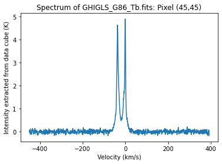

The above plot does have 2 main peaks. Then the moments and column density sum were found to be

	Mean velocity: -20.432771765296806 km/s 
	Standard deviation: 17.102151706247863 km/s 
	Skewness: 7.307203281066898
	Column Density: 101.81800184305608 (Not sure about units here, Maybe K-Km/s)

### Dividing the spectrum into two velocity ranges and finding the moments
Using scipy function *find_peaks* I found the peaks and the minima for the above spectrum which is at velocity of -17.681 km/s. So then I seperated the spectrum into two parts: left and right about this velocity. And these two parts look like:

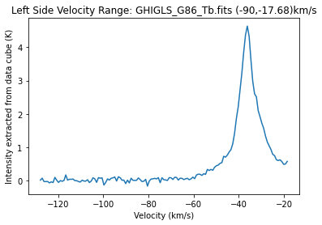

	Mean velocity: -36.83919964318618 km/s 
	Standard deviation: 10.115934829842644 km/s 
	Skewness: -2.3645335224101913

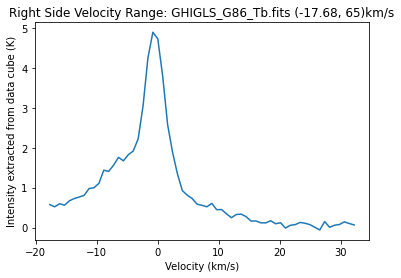

	Mean velocity: -1.5245469218482248 km/s 
	Standard deviation: 7.75119627037647 km/s 
	Skewness: 0.8754639186230907

### Noise from the end tails
In the main Spectrum of GHIGLS_G86_Tb.fits: Pixel (45,45) the noisy tails are in the velocity range: 1. left tail => (-450,-100) km/s | 2. right tail => (33,390) km/s.

So using these ranges and the *numpy.std* function we get the noise to be:

	Average noise in the left tail: 0.063227735 K 
	Average noise in the right tail: 0.0624478 K

### Fitting Gaussians to the spectrum
Using scipy.optimize.curve_fit and by tweaking the parameters a little bit I obtained an approximate gaussian for each of the parts. The fitting is shown below

1. Left Part of the Spectrum:
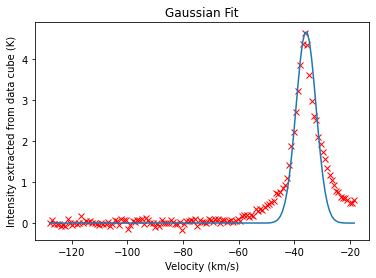
Observed values: 

	Mean velocity: -36.83919964318618 km/s 
	Standard deviation: 10.115934829842644 km/s 
	Skewness: -2.3645335224101913	 

Fitted values: 

	Mean velocity: -35.77388642 km/s 
	Standard deviation: 3.591560238 km/s

2. Right Part of the Spectrum:
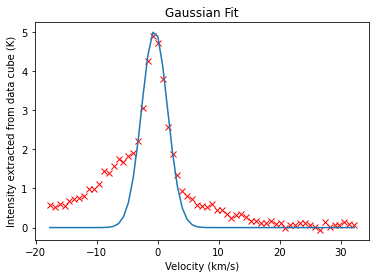

Observed values: 

	Mean velocity: -1.5245469218482248 km/s 
	Standard deviation: 7.75119627037647 km/s 
	Skewness: 0.8754639186230907

Fitted values: 

	Mean velocity: -0.49262110000000003 km/s 
	Standard deviation: 2.11400621 km/s

3. Combined Fit:
The following plot contains the superposition of the above two gaussians. The red crosses represent the actual data and the blue curve is the fitted gaussian.

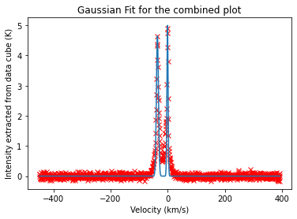

4. Residual Plot for the above fitting i.e., (data - model)
 
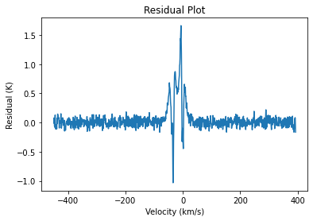

### Deriving the relation between dispersion of a Gaussian and the FWHM:
For a gaussian of the following form:

$$g(x) = \frac{1}{\sqrt{2\pi\sigma^2}}\exp\left(-\frac{(x-\mu)^2}{2\sigma^2}\right)$$

  

The FWHM is the distance between the points along x axis at which the function has a value of half of it's value at the mean. Thus we get

$$\frac{1}{2}\frac{1}{\sqrt{2\pi\sigma^2}} = \frac{1}{\sqrt{2\pi\sigma^2}}\exp\left(-\frac{(\text{FWHM/2})^2}{2\sigma^2}\right)$$

$$\frac{1}{2} = \exp\left(-\frac{(\text{FWHM/2})^2}{2\sigma^2}\right) \Rightarrow (2 \ln2)^{1/2} = \frac{\text{FWHM}}{2\sigma}$$

Thus, we finally get:

$$\text{FWHM} = {2 \ \sigma}\sqrt{2 \ln2} \approx 2.355 \ \sigma$$

  

To find FWHM in units of temp. i.e., K,

$$ \frac{1}{2}mv^2 = k_B T $$

$$ \text{FWHM (in K)} = \frac{1}{2k_B}m \ (\text{FWHM (in Km/s)})^2 = \frac{4 m \ln2}{k_B} \sigma^2$$

Here m is the mass of one of the gas particle i.e., atomic hydrogen. Thus $m = 1.008*1.67377*10^{-27} kg$.

Thus we get:

$$\text{FWHM (in K)} = \frac{4 m \ln2}{k_B} \ \sigma^2 \approx 0.00034 \ \sigma^2$$

Here $\sigma^2$ is the variance of the Gaussian in unit of (Km/s)^2.

For the fitting above we get:

	FWHM (in K) for the left part of the spectrum: 4332.776272564352 K 
	FWHM (in K) for the right part of the spectrum: 1501.1098409794247 K

### Average Column Density for the whole cube
When we just take the average value of $T_b$  for each pixel and then plot it out we get the following image:
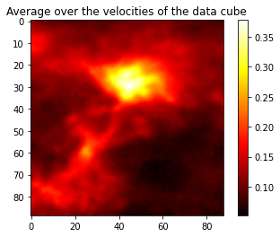

### Average spectrum for a small section of the cube
For the pixels (45-10:45+10, 45-10:45+10) we obtain the following spectrum by averaging over all the pixels:
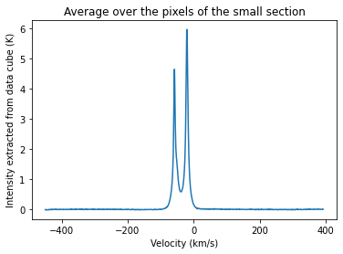
Notice that the tails have close to no noise! The noise in the average spectrum using the end-tails turns out to be:

	Noise in the left tail: 0.005715796 K
	Noise in the right tail: 0.006848051 K

Which is ~ 1/10 th of the noise obtained for a single pixel. So averaging does help!
One explaination for more error in the single pixel spectrum is through the uncertainity principle. Which is to say that when we precisely know the location of the measurement point i.e., a single pixel, we can't really know the velocity distribution precisely and vice versa is also true. 
For the average case even though we have very small error, we have lost the information about position i.e., which pixel we are finding the spectrum for? This idea is very fundamental in signal processing as well.

### Fitting a Gaussian to the average spectrum
Just like for a single pixel case, we can fit two gaussians for the average spectrum as well. The seperation point for left and right part comes out to be at velocity = -37.81 km/s. 

1. Left part of the average spectrum:

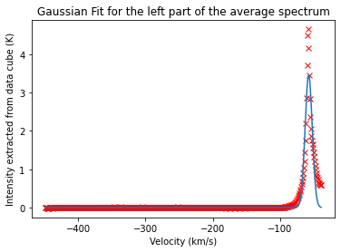
Observed values: 

	Mean velocity: -56.475494595667676 km/s 
	Standard deviation: 4.931279047848197 km/s 
	Skewness: 375.74184419241845 

Fitted values: 

	Mean velocity: -57.21576852818208 km/s 
	Standard deviation: 5.291005783571059 km/s

2. Right part of the average spectrum

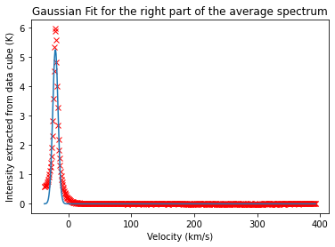
Observed values: 

	Mean velocity: -19.50592465114145 km/s 
	Standard deviation: 10.618807570355564 km/s 
	Skewness: 35.97780260306478 

Fitted values: 

	Mean velocity: -20.293848328376384 km/s 
	Standard deviation: 4.246106968646519 km/s

3. Combined Fitting to the average spectrum:

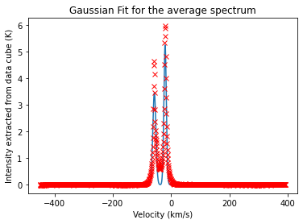
4. Residual Plot for the above fitting i.e., (data - model)

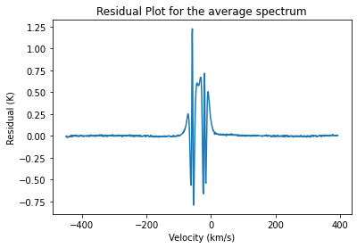
### ROHSA decomposition
Finally I used ROHSA to decompose the spectra and fit gaussians to each pixel of the cube. For fitting I used 3 gaussians and the data was for the same small region described above. The fitting produces 3 gaussian parameters for each pixel and the average is plotted below:

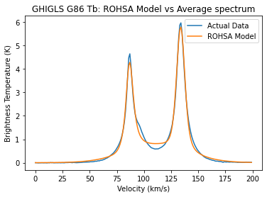

### Integrated column density maps from the ROHSA:
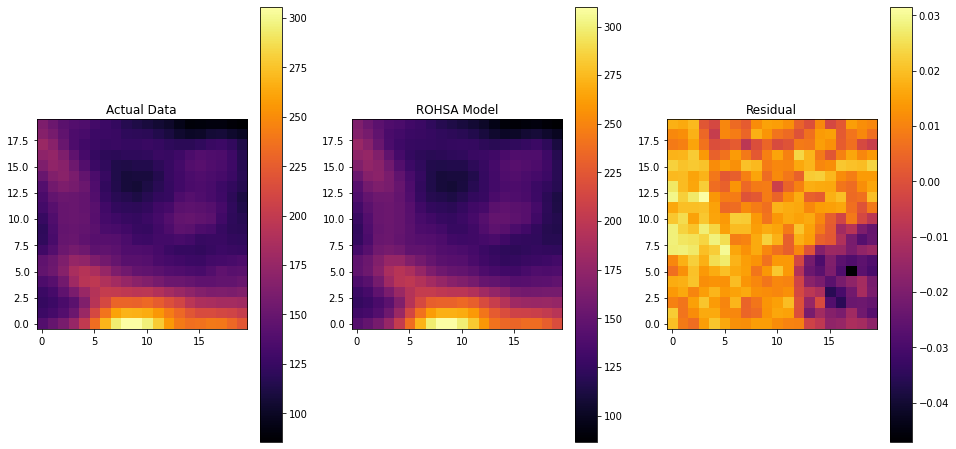
For the whole cube:
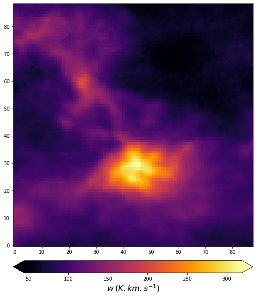

### Gaussian parameters for the three Gaussians:
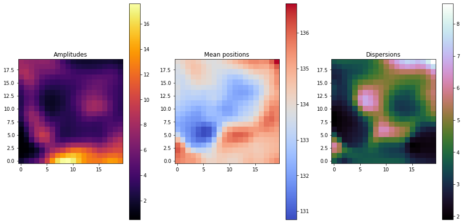
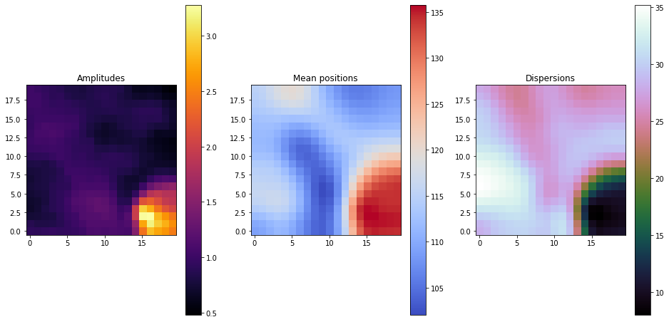
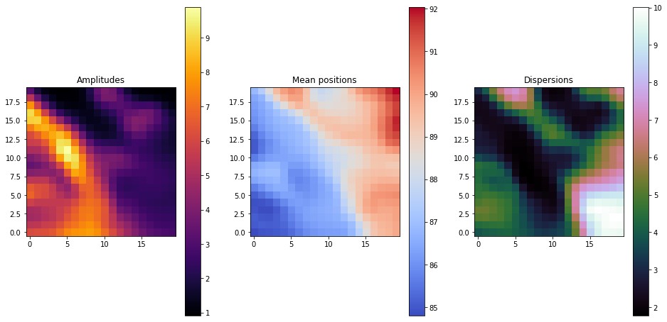

### Mosaic
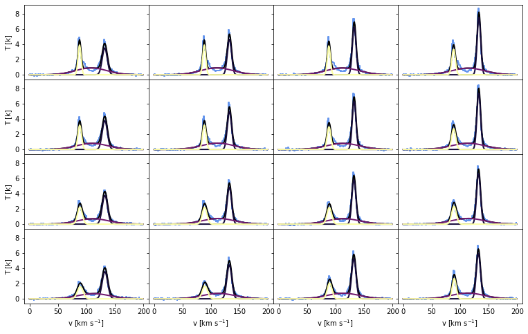
### Heatmap
Heatmap for the whole cube not just the 20x20 pixels region.

### Noise and  $\chi^2$ - Maps for the small region
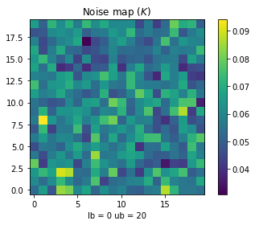

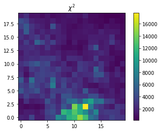

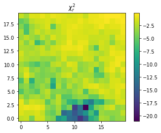
